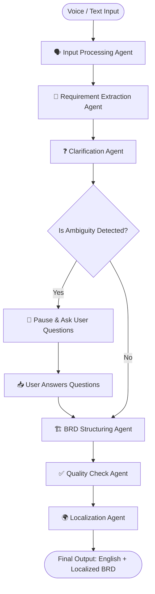

# BRD Genie 🧞‍♂️ (Multi-Agent AI PM System)

BRD Genie is a multi-agent system built with **LangGraph**, **FastAPI**, and **Streamlit** that translates messy regional voice notes or text entries (Hindi, Tamil, etc.) into comprehensive, professional, and audit-checked Business Requirements Documents (BRDs).

---

## 🧠 Architecture Flow



---

## 🛠️ Features

1. **🎙️ Voice Input**: Upload regional voice recordings (.wav, .mp3, .m4a) and convert them directly to clear English requirements.
2. **🧠 Structured Analysis**: Automatically parses messy inputs into Problems, User Roles, Features, and Constraints.
3. **❓ Stateful Clarification**: Automatically identifies missing requirements and interrupts the graph to ask 2-3 targeted questions.
4. **🏗️ Professional Output**: Generates detailed markdown documents including Scope, Persona profiles, Functional/Non-functional checklists, and standard User Stories.
5. **✅ Audit-Checked Quality**: A dedicated QA agent verifies document integrity, aligns sections, and removes ambiguities.
6. **🌐 Localized Translation**: Delivers the final document side-by-side in English and your target regional language (Hindi, Tamil, etc.).
7. **📜 Session History**: Persists all generated documents locally in an SQLite database. Easily view and reload past BRDs from the sidebar.

---

## 🚀 Getting Started

### 1. Configure Environment Variables
Copy `.env.example` to `.env` and configure your API keys:
```bash
cp .env.example .env
```
Open `.env` and add your keys:
*   `GEMINI_API_KEY`: Required for document generation, requirements extraction, and QA checks.
*   `SARVAM_API_KEY`: (Optional) Required for speech-to-text transcription. If missing, the app uses Gemini file uploads for audio and Gemini translate for translation fallbacks.

### 2. Run the Backend (FastAPI)
The backend manages the LangGraph agents and exposes the REST APIs.
```bash
.venv\Scripts\uvicorn backend.main:app --reload
```
The backend server runs on `http://127.0.0.1:8000`.

### 3. Run the Frontend (Streamlit)
Open a new terminal window or tab and launch the interactive Streamlit UI:
```bash
.venv\Scripts\streamlit run frontend/app.py
```
The frontend UI will open automatically in your browser at `http://localhost:8501`.

---

## 🧩 Agent Breakdown

*   **🗣️ Input Processor**: Utilizes **Sarvam AI STT** to transcribe raw speech, translating the output directly to English if inputted in regional tongues.
*   **🧠 Extraction Agent**: Uses **Gemini** to map unstructured transcripts to a structured requirements schema.
*   **❓ Clarification Agent**: Analyzes requirements for completeness, prompting the user with customized questions if ambiguities exist.
*   **🏗️ BRD Structuring Agent**: Takes the requirements and the user's answers and shapes them into a professional PM format.
*   **✅ Quality Check Agent**: Reviews drafts to fill in logical gaps and ensure that functional requirements align perfectly with the scope and personas.
*   **🌍 Localization Agent**: Uses **Sarvam AI Translation** (or Gemini translation fallback) to translate the final document into the chosen target language.
